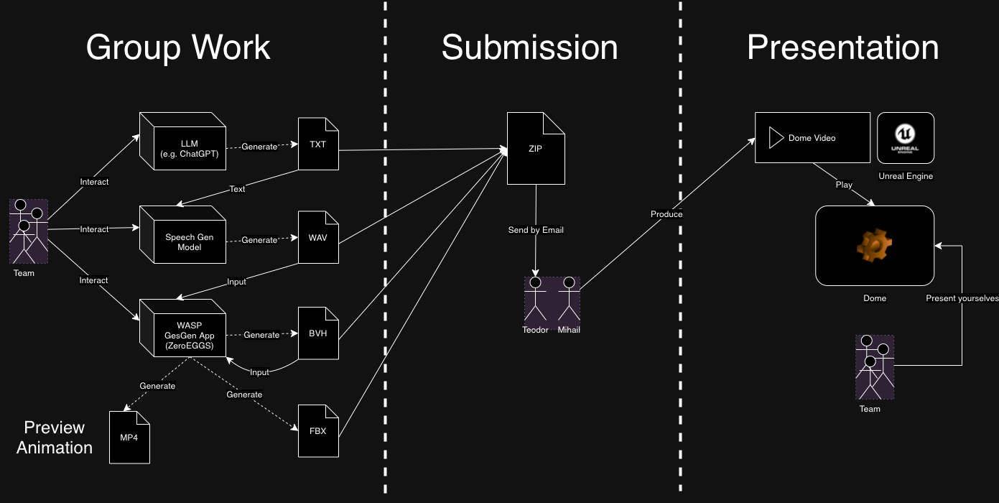

# WASP Summer School 2024 On-site Assignment

This repo hosts all the information you need to complete the WASP Summer School 2024 on-site assignment.

### Assignment

## Agenda

Agenda taken from [here](https://wasp-sweden.org/event/joint-summer-school-on-generative-ai-2024/). Changes are unlikely, but you will be notified if they occur.

- Monday - Free
- Tuesday 16:00 - Introduction to assignment
- Wednesday 09:00 - 17:00 - Work on the assignment
- Thursday 09:00 - 12:00 - Work on the assignment
- **Thursday 12:00 - Submission deadline**
- Friday 09:30 - 10:30 - Video presentation in the dome

## Goal

This assignment lets you explore how AI can be used to create a complete storytelling experience. You'll use AI to script a story, turn it into speech, and animate it with gesturing avatars. The focus is on understanding how these tools work together, using the files you generate and the parameters you control. This is your opportunity to experiment, learn, and have fun with the technology.

**Submissions 2023**
- [Talent Show Introduction](https://youtube.com/watch?v=GivcAqaoIQ4)
- [Team: Algorithmic Amigos](https://youtube.com/watch?v=RyWqAy3Yidk)
- [Team: VR WASP Wizards](https://youtube.com/watch?v=CeGuwhIivNY&t=16s)
- [Team: Artificial Four](https://youtube.com/watch?v=Obdmat3U7s0)
- [Team: Quebec](https://youtube.com/watch?v=dor8EfV6TeI&t=111s)
- [Team: Lucasfilm Ltd TM](https://youtube.com/watch?v=TppQ7tklMCQ)

**Submissions 2022**
- [Team 1](https://www.youtube.com/watch?v=IyaEcUJp6G8)
- [Team 2](https://www.youtube.com/watch?v=OJMNvtoPsfk)
- [Team 3](https://www.youtube.com/watch?v=3mwK3OCXH9k)
- [Team 4](https://www.youtube.com/watch?v=h8z85fxWz10)

### Theme Description: "Cringy Sitcom"

This year's theme, "Cringy Sitcom," invites you to create awkward and exaggerated scenes reminiscent of classic TV sitcoms. Think of cheesy one-liners, over-the-top reactions, and characters who find themselves in hilariously uncomfortable situations. While the theme serves as a fun, unifying idea for all submissions, it's just a suggestion - you're free to get creative and go in any direction you like. The theme will also guide the hosts who present the final videos, adding some light-hearted humor to the showcase.

### Process

The assignment is split in three stages:

**Stage 1. Group Work**

You work with your team to create text, audio, and animation files for your story.

- Text (.txt): You use LLMs (like ChatGPT) to create a script for your story.
- Audio (.wav): You use a text-to-audio model to generate speech audio. This year, you will most likely use the model you trained for the pre-summer school assignment (on Canvas). You can use different voices for this, not just your own. You can also stitch the audio and add silence to control the pacing.
- Animation (.bvh, .fbx): You use the WASP gesgen app to generate gesture animations from speech audio.

**Stage 2. Submission**

You zip all '.txt', '.wav', '.bvh', and '.fbx' files to a '.zip' file which you submit to us. More info below.

**Stage 3. Presentation**

We take your files and use them to produce movie sequences in Unreal Engine. We will put a brief intro and outro at the beginning and end of your story to glue your submission with the overarching *Cringy Sitcom* theme.

We then playback these sequences in the Norrkoping Visualization Center's Dome. Before playing your video, you will be called to briefly present your team and experience making the story.

## Submission
To submit, send an email to `tnikolov@hotmail.com` OR `tsakovm@gmail.com`.

Your submission should be **2-5 minutes** long and be composed of the following files:
- a `.zip` of `.fbx` files
- a `.zip` of `.wav` files
- a `.txt` file

The `.fbx` and `.wav` files should be named in ascending order, starting from 0, in the order that they should be played back. Append `A`, `B`, `C`, `D` or `E` to each file to indicate which avatar you wish to use for the animation. The `.fbx` files are extracted using the gesture generation system.

  
   
  <i>The 5 avatars to choose from.</i>

*Example:*
- fbx.zip
    - 0A.fbx
    - 1C.fbx
    - 2C.fbx
    - 3B.fbx
    - 4C.fbx
    - 5D.fbx
- wav.zip
    - 0A.wav
    - 1C.wav
    - 2C.wav
    - 3B.wav
    - 4C.wav
    - 5D.wav

The `.txt` file should contain the following information:
- Team name or ID
- World

*Example:*
- Jackal.txt
    - Team "Jackal"
    - World "Tropical island"

We have the following teams this year:
1. *Algorithmic Amigos*
2. *VR WASP Wizards*
3. *Artificial Four*
4. *Quebec*
5. *Lucasfilm Ltd TM*

We offer 5 worlds to choose from:

**Egypt**

  

**Asian village**

  

**Tropical island**

  

**Venice**

  

**ForestLevel**

  

You can find more examples in the [images](https://github.com/Svito-zar/wasp-2023-summer-school/blob/main/Images/) folder.

## Presentation Files

The Monday student assignment presentation is in file `student-assignment.pptx`.

The demo video for the student assignment shown on Monday can be found [on YouTube](https://www.youtube.com/watch?v=by40aaCbLpY).
